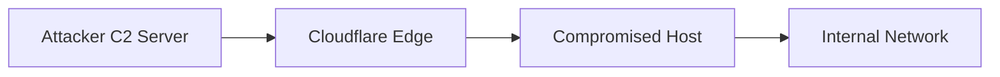

---
tags:
  - cloudflare
  - tunnels
  - malware
  - lateral-movement
  - ngrok
created: 2024-01-02
status: active
severity: high
author: detection_engineer
type: Command & Control
---
## Summary
Threat actors are increasingly leveraging Cloudflare Tunnels (formerly Argo Tunnel) as a covert channel for command and control (C2) communications. This technique allows attackers to bypass traditional security controls by tunneling malicious traffic through legitimate Cloudflare infrastructure.

| Attribute | Details |
|-----------|---------|
| Definition | Abuse of legitimate Cloudflare Tunnel service for malicious command & control (C2) communications |
| CVE | N/A (Abuse of legitimate service) |
| Affected Systems | Any system capable of running Cloudflare Tunnel client |
| Severity | High |
| Discovery | December 2023 |
| MITRE ATT&CK | T1090 - Connection Proxy<br>T1571 - Non-Standard Port<br>T1572 - Protocol Tunneling |
## Technical Details

### How It Works
1. Attackers create a Cloudflare Tunnel using compromised or fraudulent accounts
2. The tunnel client (`cloudflared`) is deployed on compromised systems
3. Malicious traffic is encapsulated within legitimate TLS connections to Cloudflare's edge
4. Traffic appears to originate from legitimate Cloudflare IPs
5. Traditional IP/domain-based blocking becomes ineffective

### Attack Flow


## Notable Examples
- December 2023: Researchers identified multiple malware families utilizing Cloudflare Tunnels
- Similar to previous abuse of ngrok and other tunneling services
- Used in conjunction with living-off-the-land binaries (LOLBins)

## Impact
- Bypasses traditional network security controls
- Difficult to detect due to legitimate service use
- Enables persistent access to compromised networks
- Facilitates lateral movement
- Complicates incident response

## Detection & Mitigation

### Prevention
- Implement strict software installation policies
- Monitor and control Cloudflare Tunnel client installations
- Maintain updated asset inventory
- Implement Zero Trust Network Access (ZTNA)

### Detection Methods
```yaml
Detection Rules:
- Monitor for unauthorized cloudflared.exe processes
- Track unexpected outbound connections to Cloudflare ranges
- Alert on unusual Cloudflare Tunnel creation patterns
- Monitor for suspicious certificate generation
```

### Response Procedures
1. Identify and terminate unauthorized tunnel processes
2. Block unauthorized Cloudflare Tunnel clients
3. Review network logs for potential lateral movement
4. Implement network segmentation
5. Contact Cloudflare for suspicious tunnel investigation

## Hunting Queries

### Windows (PowerShell)
```powershell
Get-Process | Where-Object {$_.ProcessName -like "*cloudflared*"}
```

### Linux
```bash
ps aux | grep cloudflared
```

### Splunk
```sql
index=* sourcetype=windows ProcessName=*cloudflared* 
| stats count by Host, User, CommandLine
```

## Further Reading
1. [Cloudflare Tunnel Documentation](https://developers.cloudflare.com/cloudflare-one/connections/connect-apps/)
2. [MITRE ATT&CK: Protocol Tunneling](https://attack.mitre.org/techniques/T1572/)
3. [Microsoft Security Blog: Detecting Tunnel Abuse](https://www.microsoft.com/security/blog/2021/03/25/detecting-and-preventing-tunnel-abuse/)

## Related Topics
- Ngrok Abuse
- Reverse Tunneling
- C2 Infrastructure
- Network Security Monitoring
- Zero Trust Architecture

Related Page: [[Hackers Leveraging Cloudflare Tunnels, DNS Fast-Flux to Hide GammaDrop Malware]]