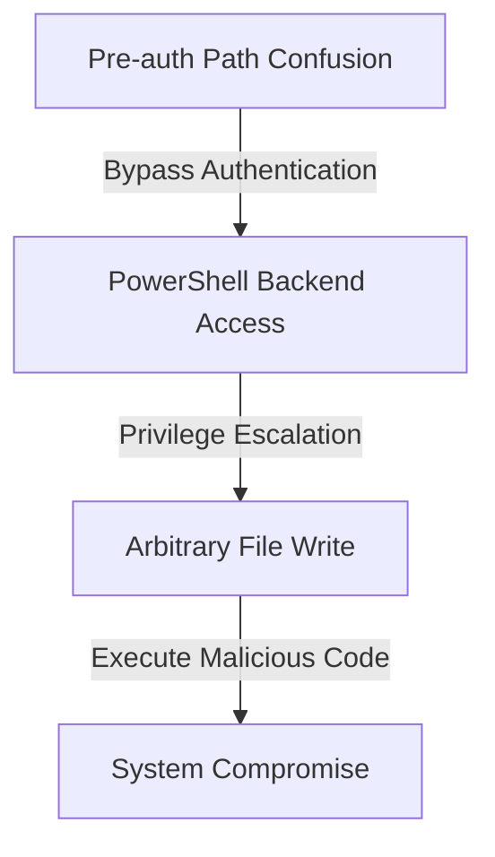

---
tags:
  - CVE
  - Exchange
  - RCE
  - vulnerability
  - ProxyShell
created: 2024-01-10
severity: Critical
status: Historical
platform: Microsoft Exchange
type: vulnerability
---
## Overview
ProxyShell is a critical vulnerability chain in Microsoft Exchange Server that enables attackers to perform unauthenticated remote code execution. The exploit chain was discovered by Orange Tsai and presented at BlackHat USA 2021.

| Attribute | Details |
|-----------|---------|
| Definition | A chain of three vulnerabilities affecting Microsoft Exchange Server that allows unauthenticated remote code execution |
| CVE IDs | CVE-2021-34473, CVE-2021-34523, CVE-2021-31207 |
| Affected Systems | Microsoft Exchange Server 2013, 2016, and 2019 |
| Severity | Critical (CVSS 9.8) |
| Discovery | July 2021 (BlackHat USA Conference) |
| Patch Availability | July/August 2021 Security Updates |

## Technical Details

### Vulnerability Chain Components
1. **CVE-2021-34473**: Pre-auth path confusion vulnerability
   - Allows bypass of pre-authentication
   - CVSS Score: 9.8

2. **CVE-2021-34523**: Elevation of privilege in Exchange PowerShell
   - Enables privilege escalation
   - CVSS Score: 9.8

3. **CVE-2021-31207**: Post-authentication arbitrary file write
   - Permits malicious file creation
   - CVSS Score: 7.2

### Attack Flow


## Notable Incidents
- August 2021: Mass scanning and exploitation attempts detected globally
- September 2021: Multiple ransomware groups began leveraging ProxyShell
- Multiple APT groups incorporated ProxyShell into their toolsets

## Impact and Consequences
- Remote Code Execution (RCE)
- Data exfiltration
- Ransomware deployment
- Business email compromise
- Lateral movement within networks

## Detection Methods

### Log Analysis
```powershell
# Example Exchange IIS Log patterns to monitor
GET /autodiscover/autodiscover.json
POST /autodiscover/autodiscover.json
```

### Network Indicators
- Suspicious PowerShell requests to `/autodiscover/autodiscover.json`
- Anomalous POST requests to Exchange endpoints
- Unexpected outbound connections from Exchange servers

## Mitigation Strategies

### Immediate Actions
1. Apply Microsoft Security Updates:
   - KB5003435 (Exchange 2019)
   - KB5003435 (Exchange 2016)
   - KB5003435 (Exchange 2013)

### Preventive Measures
- Implement Network Segmentation
- Regular Security Updates
- Enhanced Monitoring
- Zero Trust Architecture Implementation

### Response Procedures
1. Isolate affected systems
2. Conduct forensic analysis
3. Review Exchange logs
4. Reset compromised credentials
5. Implement additional security controls

## Further Reading
1. [Microsoft Security Response Center - ProxyShell Vulnerabilities](https://msrc.microsoft.com/update-guide/vulnerability)
2. [Orange Tsai's Technical Analysis](https://blog.orange.tw/2021/08/proxyshell-a-new-attack-surface-on-ms-exchange-part-1.html)
3. [CISA Alert (AA21-259A)](https://www.cisa.gov/news-events/cybersecurity-advisories/aa21-259a)

## Related Topics
- [[Exchange Server Security]]
- [[Remote Code Execution]]
- [[PowerShell Security]]
- [[CVE-2021-34473]]
- [[CVE-2021-34523]]
- [[CVE-2021-31207]]