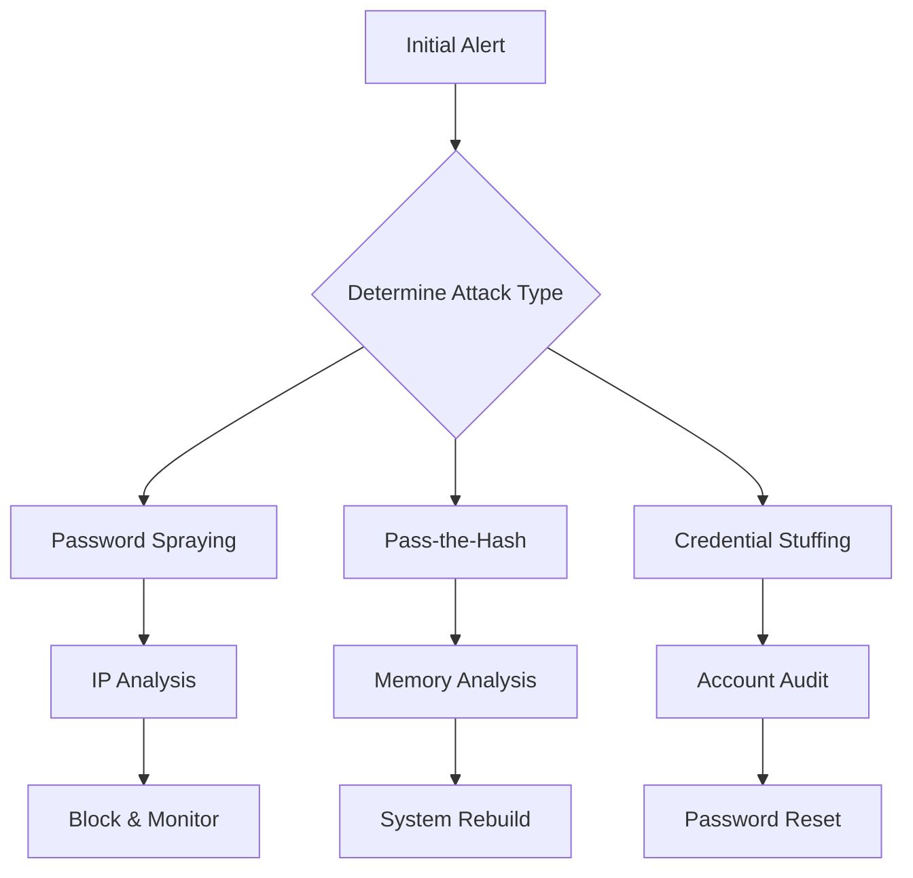

## Types of Credential Attacks

### 1. Password Spraying
**Description:** Attempting a small set of common passwords against many accounts
**Example Attack Pattern:**
```
Target: Corporate Office 365
Time: 2:00 AM - 4:00 AM
Pattern:
  - 1 password attempt per account
  - Password: Spring2024!
  - 2000+ accounts targeted
  - Distributed across 100+ IPs
```

**Detection Indicators:**
```
- Multiple failed logins across accounts
- Same password across attempts
- Distributed source IPs
- Off-hours activity
- Consistent time gaps between attempts
```

<div class="neon-line"></div>
### 2. Credential Stuffing
**Description:** Testing leaked username/password combinations
**Example Pattern:**
```
Login Attempts:
john.doe@company.com:Password123
john.doe@company.com:Password123!
john.doe@company.com:Password1234
[Pattern suggests automated testing of variants]
```

**Detection Indicators:**
```
- High volume of attempts per account
- Multiple password variations
- Automated timing patterns
- Known compromised credentials
```

<div class="neon-line"></div>
### 3. Pass-the-Hash (PtH)
**Description:** Reusing captured NTLM hashes without knowing the plaintext password
**Example Attack:**
```
Event Log:
4624: Account Logon
  - Logon Type: 3 (Network)
  - Authentication Package: NTLM
  - Source IP: Internal
  - No Kerberos TGT requested
```

**Detection Indicators:**
```
- NTLM authentication from unexpected sources
- Lateral movement patterns
- Missing Kerberos authentication
- Administrative account usage from non-admin workstations
```

mp<div class="neon-line"></div>
### 4. Kerberos Attacks
**Examples:**
- Golden Ticket: Forged TGT using compromised krbtgt hash
- Silver Ticket: Forged service ticket using service account hash
- Kerberoasting: Requesting service tickets for cracking

**Detection Pattern:**
```
Event ID 4769 (TGS Request):
  - Service Name: Unusual service
  - Encryption Type: RC4 (Type 0x17)
  - Client Address: Unexpected workstation
```

<div class="neon-line"></div>
## Real-Time Detection Scenarios

### Scenario 1: Active Password Spraying

#### Initial Alert
```
Time: 02:15 AM EST
Source: Azure AD Identity Protection
Alert: Suspicious sign-in attempts
Affected: Multiple accounts
Pattern: Single attempt per account
```

#### Detection Process

1. **Immediate Analysis** (First 5 minutes)
```sql
-- Azure AD Sign-in Logs Query
SELECT
    UserPrincipalName,
    IPAddress,
    Location,
    ResultType,
    COUNT(*) as AttemptCount
FROM SignInLogs
WHERE TimeGenerated > ago(1h)
AND ResultType == "50126" // Wrong password
GROUP BY UserPrincipalName, IPAddress, Location, ResultType
HAVING COUNT(*) > 1
```

2. **Pattern Recognition** (Next 10 minutes)
- Check for:
  * Geographic distribution of IPs
  * Time between attempts
  * Password patterns
  * Target account patterns

3. **Scope Assessment** (Next 15 minutes)
```
Indicators to Track:
- Total accounts targeted
- Success rate
- IP address ranges
- Authentication protocols used
- Affected business units
```

<div class="neon-line"></div>
### Scenario 2: Pass-the-Hash Detection

#### Initial Alert
```
Time: 13:45 PM EST
Source: EDR Platform
Alert: Suspicious NTLM authentication
Host: ADMIN-WS01
Destination: FILE-SVR02
User Context: Domain Admin
```

#### Detection Process

1. **Initial Triage** (First 5 minutes)
```
Check:
- Source host authorization
- User's normal access patterns
- Authentication protocol used
- Related processes
```

2. **Timeline Analysis** (Next 10 minutes)
```
Events to Correlate:
1. Initial compromise indicator
2. Credential extraction attempt
3. Lateral movement pattern
4. Target access events
```

3. **Lateral Movement Hunt** (Next 15 minutes)
```powershell
# Sample Detection Query
Get-WinEvent -FilterHashtable @{
    LogName = 'Security'
    ID = 4624, 4625, 4672
} | Where-Object {
    $_.Properties[8].Value -eq 3 -and  # Type 3 - Network
    $_.Properties[9].Value -eq 'NTLM'  # NTLM Auth
}
```

<div class="neon-line"></div>
## Response Procedures

### 1. Immediate Containment Actions

#### For Password Spraying
```
Priority: High
Timeline: Immediate (First 30 minutes)

1. Block attacking IPs
2. Enable Smart Lockout
3. Force MFA for all accounts
4. Alert SOC for monitoring
```

#### For Pass-the-Hash
```
Priority: Critical
Timeline: Immediate

1. Isolate affected systems
2. Disable compromised accounts
3. Block lateral movement
4. Preserve memory evidence
```

### 2. Investigation Steps



### 3. Evidence Collection
```
Required Artifacts:
1. Authentication logs
2. Network traffic captures
3. Memory dumps
4. Event logs
5. EDR timeline
```

<div class="neon-line"></div>
## Prevention & Mitigation

### 1. Technical Controls
```
Priority Implementation:
1. MFA Enforcement
2. Password Policies
   - Length: 16+ characters
   - Complexity: Enabled
   - History: 24 passwords
3. Account Lockout
   - Threshold: 5 attempts
   - Duration: 30 minutes
4. Just-In-Time Access
```

### 2. Monitoring Improvements
```
Enhanced Detection:
1. Authentication Pattern Baselines
2. Geolocation Monitoring
3. Login Velocity Checks
4. Protocol Usage Analysis
5. Service Account Monitoring
```

### 3. Risk Reduction
```
Strategic Changes:
1. Privileged Access Workstations
2. Network Segmentation
3. Regular Credential Rotation
4. Kerberos Armoring
5. LAPS Implementation
```

<div class="neon-line"></div>
## SIEM Detection Rules

### 1. Password Spray Detection
```
Rule Logic:
IF (failed_logins > 3 PER account)
AND (unique_passwords < 3)
AND (unique_source_ips > 5)
AND (timeframe < 1 hour)
THEN ALERT "Potential Password Spray Attack"
```

### 2. Pass-the-Hash Detection
```
Rule Logic:
IF (authentication_type = "NTLM")
AND (logon_type = 3)
AND (
    source_workstation NOT IN authorized_admin_hosts
    OR time_of_day NOT IN business_hours
)
THEN ALERT "Potential Pass-the-Hash Attack"
```

<div class="neon-line"></div>
## Key Interview Discussion Points

### 1. Detection Strategy
- Baseline behavior understanding
- Alert correlation importance
- False positive handling
- Detection tuning process

### 2. Response Priorities
- Business impact assessment
- Containment vs. monitoring
- Evidence preservation
- Communication workflow

### 3. Prevention Focus
- Zero Trust implementation
- Privileged access management
- Monitoring improvements
- Training requirements


Some key points to emphasize in your interview:

1. Understanding attack patterns and variations
2. The importance of quick containment while maintaining evidence
3. Balancing security with business operations
4. The value of proactive monitoring and baseline understanding

---
<div style="text-align: center;">
	<div class="gradient-text">👾 2024 rabb1th0les (Chris A)dams 👾</div> 
	🌴☀Thanks for supporting my page ☀🌴
	<nav>
		<ul style="list-style: none; padding: 0;">
			<div style="text-align: center;">
				<li><a href="index.html">Home</a> | <a href="Contact.html">Contact</a></li>
			</div>
		</ul>
	</nav>	
</div>