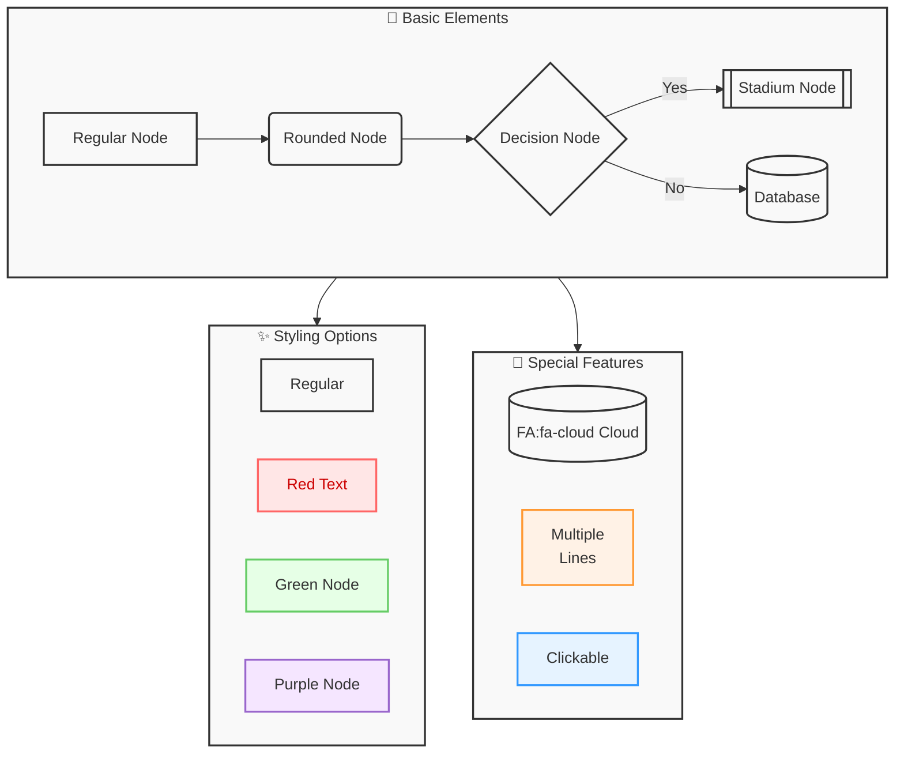

# What are Diagrams as Code?

Diagrams as code are a way to easily create flow charts by use of code. The main language I have been using for creating these has been *Mermaid*. [[Mermaid]] diagrams are a `javascript` based diagramming and charting tool that renders Markdown-inspired text definitions to create and modify diagrams dynamically

In my project, I have been using `Claude` AI for generating flow charts and have been having much success. Below is an example of some of the features mermaid has.

Here is the code that produced this flowchart:


> [!INFO] Info
> I did make some little edits for visibility and color in the `diagrams.net` plugin in `Obsidian`.


```
graph TD
    subgraph Core["🎨 Basic Elements"]
        A[Regular Node] --> B(Rounded Node)
        B --> C{Decision Node}
        C -->|Yes| D[[Stadium Node]]
        C -->|No| E[(Database)]
    end
    
    subgraph Styles["✨ Styling Options"]
        F[Regular]
        G[Red Text]:::redText
        H[Green Node]:::greenNode
        I[Purple Node]:::purpleNode
    end
    
    subgraph Special["🌟 Special Features"]
        J[("FA:fa-cloud Cloud")]
        K["Multiple<br/>Lines"]:::orangeNode
        L["Clickable"]:::blueNode
        click L href "#" "This node is clickable"
    end
    
    Core --> Styles
    Core --> Special
    
    classDef default fill:#f9f9f9,stroke:#333,stroke-width:2px
    classDef redText fill:#ffe6e6,stroke:#ff6666,stroke-width:2px,color:#cc0000
    classDef greenNode fill:#e6ffe6,stroke:#66cc66,stroke-width:2px
    classDef purpleNode fill:#f5e6ff,stroke:#9966cc,stroke-width:2px
    classDef blueNode fill:#e6f3ff,stroke:#3399ff,stroke-width:2px
    classDef orangeNode fill:#fff2e6,stroke:#ff9933,stroke-width:2px
    
    class A,B,C,D,E default
    class Core,Styles,Special default
```
It is possible to render this directly using code blocks, however, it does have some issues with producing the complete output. I use a plugin called `diagrams.net`, here is the Github link https://github.com/jensmtg/obsidian-diagrams-net. It enables a `/` command to open a new window to create a flow chart. 

Below is the rendering error from using the built-in code blocks.


> [!NOTE] Edit 2024-11-10 19:51
> After checking the `npx` build, it appears that locally the rendering is not working, but when I build it locally it does work. Sort of odd... in time, I may have some more details on that. 





A flow chart can then be created by using `Mermaid` syntax in **Insert** > **Advanced** > **Mermaid** while in `draw.io`.

---
<div style="text-align: center;">
	<div class="gradient-text">👾 2024 rabb1th0les (Chris A)dams 👾</div> 
	🌴☀Thanks for supporting my page ☀🌴
	<nav>
		<ul style="list-style: none; padding: 0;">
			<div style="text-align: center;">
				<li><a href="index.html">Home</a> | <a href="Contact.html">Contact</a></li>
			</div>
		</ul>
	</nav>	
</div>