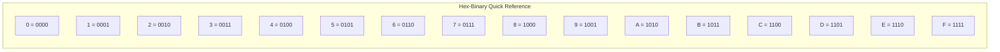
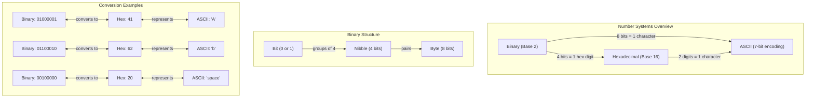

This diagram shows:

1. Basic Structure:
   - How bits, nibbles, and bytes relate to each other
   - The relationship between binary, hexadecimal, and ASCII
   - How each system converts to the others

2. Key Relationships:
   - 4 bits (one nibble) = 1 hexadecimal digit
   - 8 bits (one byte) = 1 ASCII character
   - 2 hexadecimal digits = 1 ASCII character

3. Examples:
   - Letter 'A': 01000001 (binary) = 41 (hex) = 65 (decimal) = 'A' (ASCII)
   - Letter 'b': 01100010 (binary) = 62 (hex) = 98 (decimal) = 'b' (ASCII)
   - Space character: 00100000 (binary) = 20 (hex) = 32 (decimal) = ' ' (ASCII)

4. Quick Reference:
   - Complete hexadecimal to binary conversion table (0-F)
   - Shows the 4-bit binary pattern for each hex digit

# Reference Tables

## Conversion Reference Chart

### ASCII Control Characters (0x00 - 0x1F)
| Hex  | Binary      | Decimal | ASCII Description |
|------|-------------|---------|-------------------|
| 0x00 | 0000 0000  | 0       | Null             |
| 0x01 | 0000 0001  | 1       | Start of Heading |
| 0x02 | 0000 0010  | 2       | Start of Text    |
| 0x03 | 0000 0011  | 3       | End of Text      |
| 0x07 | 0000 0111  | 7       | Bell             |
| 0x08 | 0000 1000  | 8       | Backspace        |
| 0x09 | 0000 1001  | 9       | Horizontal Tab   |
| 0x0A | 0000 1010  | 10      | Line Feed        |
| 0x0D | 0000 1101  | 13      | Carriage Return  |
| 0x1B | 0001 1011  | 27      | Escape           |

## Printable Characters (0x20 - 0x7E)

### Special Characters
| Hex  | Binary      | Decimal | ASCII |
|------|-------------|---------|-------|
| 0x20 | 0010 0000  | 32      | Space |
| 0x21 | 0010 0001  | 33      | !     |
| 0x22 | 0010 0010  | 34      | "     |
| 0x23 | 0010 0011  | 35      | #     |
| 0x24 | 0010 0100  | 36      | $     |
| 0x25 | 0010 0101  | 37      | %     |
| 0x26 | 0010 0110  | 38      | &     |
| 0x27 | 0010 0111  | 39      | '     |
| 0x28 | 0010 1000  | 40      | (     |
| 0x29 | 0010 1001  | 41      | )     |
| 0x2A | 0010 1010  | 42      | *     |
| 0x2B | 0010 1011  | 43      | +     |
| 0x2C | 0010 1100  | 44      | ,     |
| 0x2D | 0010 1101  | 45      | -     |
| 0x2E | 0010 1110  | 46      | .     |
| 0x2F | 0010 1111  | 47      | /     |

### Numbers
| Hex  | Binary      | Decimal | ASCII |
|------|-------------|---------|-------|
| 0x30 | 0011 0000  | 48      | 0     |
| 0x31 | 0011 0001  | 49      | 1     |
| 0x32 | 0011 0010  | 50      | 2     |
| 0x33 | 0011 0011  | 51      | 3     |
| 0x34 | 0011 0100  | 52      | 4     |
| 0x35 | 0011 0101  | 53      | 5     |
| 0x36 | 0011 0110  | 54      | 6     |
| 0x37 | 0011 0111  | 55      | 7     |
| 0x38 | 0011 1000  | 56      | 8     |
| 0x39 | 0011 1001  | 57      | 9     |

### Uppercase Letters
| Hex  | Binary      | Decimal | ASCII |
|------|-------------|---------|-------|
| 0x41 | 0100 0001  | 65      | A     |
| 0x42 | 0100 0010  | 66      | B     |
| 0x43 | 0100 0011  | 67      | C     |
| 0x44 | 0100 0100  | 68      | D     |
| 0x45 | 0100 0101  | 69      | E     |
| 0x46 | 0100 0110  | 70      | F     |
| 0x47 | 0100 0111  | 71      | G     |
| 0x48 | 0100 1000  | 72      | H     |
| 0x49 | 0100 1001  | 73      | I     |
| 0x4A | 0100 1010  | 74      | J     |
| 0x4B | 0100 1011  | 75      | K     |
| 0x4C | 0100 1100  | 76      | L     |
| 0x4D | 0100 1101  | 77      | M     |
| 0x4E | 0100 1110  | 78      | N     |
| 0x4F | 0100 1111  | 79      | O     |
| 0x50 | 0101 0000  | 80      | P     |
| 0x51 | 0101 0001  | 81      | Q     |
| 0x52 | 0101 0010  | 82      | R     |
| 0x53 | 0101 0011  | 83      | S     |
| 0x54 | 0101 0100  | 84      | T     |
| 0x55 | 0101 0101  | 85      | U     |
| 0x56 | 0101 0110  | 86      | V     |
| 0x57 | 0101 0111  | 87      | W     |
| 0x58 | 0101 1000  | 88      | X     |
| 0x59 | 0101 1001  | 89      | Y     |
| 0x5A | 0101 1010  | 90      | Z     |

### Lowercase Letters
| Hex  | Binary      | Decimal | ASCII |
|------|-------------|---------|-------|
| 0x61 | 0110 0001  | 97      | a     |
| 0x62 | 0110 0010  | 98      | b     |
| 0x63 | 0110 0011  | 99      | c     |
| 0x64 | 0110 0100  | 100     | d     |
| 0x65 | 0110 0101  | 101     | e     |
| 0x66 | 0110 0110  | 102     | f     |
| 0x67 | 0110 0111  | 103     | g     |
| 0x68 | 0110 1000  | 104     | h     |
| 0x69 | 0110 1001  | 105     | i     |
| 0x6A | 0110 1010  | 106     | j     |
| 0x6B | 0110 1011  | 107     | k     |
| 0x6C | 0110 1100  | 108     | l     |
| 0x6D | 0110 1101  | 109     | m     |
| 0x6E | 0110 1110  | 110     | n     |
| 0x6F | 0110 1111  | 111     | o     |
| 0x70 | 0111 0000  | 112     | p     |
| 0x71 | 0111 0001  | 113     | q     |
| 0x72 | 0111 0010  | 114     | r     |
| 0x73 | 0111 0011  | 115     | s     |
| 0x74 | 0111 0100  | 116     | t     |
| 0x75 | 0111 0101  | 117     | u     |
| 0x76 | 0111 0110  | 118     | v     |
| 0x77 | 0111 0111  | 119     | w     |
| 0x78 | 0111 1000  | 120     | x     |
| 0x79 | 0111 1001  | 121     | y     |
| 0x7A | 0111 1010  | 122     | z     |

## Key Patterns to Notice:
1. Uppercase letters (A-Z) range from 0x41 to 0x5A
2. Lowercase letters (a-z) range from 0x61 to 0x7A
3. Numbers (0-9) range from 0x30 to 0x39
4. The difference between uppercase and lowercase letters is always 0x20 (32 in decimal)
5. ASCII control characters are all below 0x20
6. Printable characters range from 0x20 to 0x7E

## Quick Binary-Hex Reference
- 0000 = 0
- 0001 = 1
- 0010 = 2
- 0011 = 3
- 0100 = 4
- 0101 = 5
- 0110 = 6
- 0111 = 7
- 1000 = 8
- 1001 = 9
- 1010 = A
- 1011 = B
- 1100 = C
- 1101 = D
- 1110 = E
- 1111 = F

This reference chart includes:
1. Common ASCII control characters
2. All printable ASCII characters organized by type (special characters, numbers, uppercase letters, lowercase letters)
3. Their corresponding hex and binary values
4. Key patterns to help with memorization
5. A quick binary-to-hex conversion reference

---

	
👾 2024 rabb1th0les (Chris A)dams 👾
 
	🌴☀Thanks for supporting my page ☀🌴
	<nav>
		<ul style="list-style: none; padding: 0;">
			

				<li><a href="index.html">Home</a> | <a href="Contact.html">Contact</a></li>
			

		</ul>
	</nav>	

