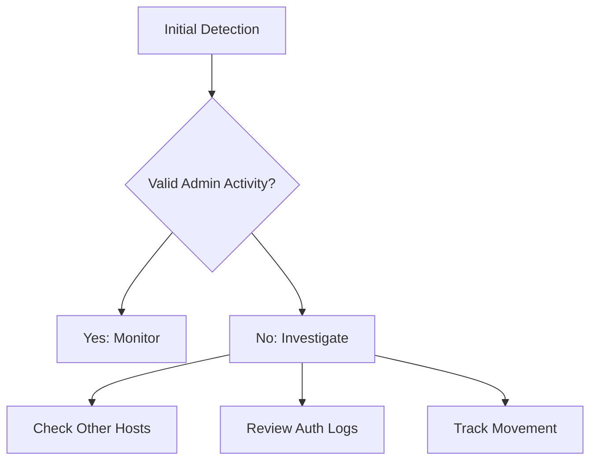

## Common Techniques & Tools

### 1. PsExec Movement
**Attack Pattern:**
```
Process Chain:
cmd.exe
└── psexec.exe \\target-host -u admin -p pass cmd.exe
    └── psexsvc.exe (on target)
        └── cmd.exe (new process)
```

**Detection Indicators:**
```
1. Service Creation:
   - Service Name: PSEXESVC
   - Binary Path: %SystemRoot%\PSEXESVC.exe
   
2. Network Activity:
   - SMB connections (445/tcp)
   - Admin$ share access
   - Remote process creation
```

### 2. WMI Execution
**Attack Pattern:**
```powershell
# Common Attack Command
wmic /node:"target-host" process call create "cmd.exe /c payload.exe"

Event Indicators:
- EventID 4648 (Explicit Credentials)
- EventID 4624 (Network Logon)
- WmiPrvSE.exe activity
```

### 3. RDP Movement
**Indicators:**
```
1. Authentication:
   - Event ID 4624 (Logon Type 10)
   - Event ID 4778 (Session Reconnected)
   
2. Network:
   - Port 3389/tcp
   - TLS negotiation
   - RDP cookie creation
```

## Real-Time Detection Scenarios

### Scenario 1: Active PsExec Movement

#### Initial Alert
```
Time: 14:22 PM EST
Source: EDR Platform
Alert: Suspicious Remote Execution
Source Host: WKSTN-IT4
Target Host: SRV-APP2
Tool: PsExec.exe
User Context: Domain Admin
```

#### Detection Process

1. **Initial Triage** (First 5 minutes)
```sql
-- Query for related activity
SELECT
    SourceHost,
    TargetHost,
    UserAccount,
    ProcessName,
    CommandLine
FROM EDREvents
WHERE TimeGenerated > ago(1h)
AND (
    ProcessName LIKE '%psexec%' OR
    ProcessName LIKE '%wmic%' OR
    ProcessName LIKE '%winrm%'
)
```

2. **Pattern Analysis** (Next 10 minutes)
```
Check for:
- Previous successful logins
- Admin share access
- Service creation patterns
- Authentication chains
```

3. **Scope Assessment**


### Scenario 2: WMI Lateral Movement

#### Initial Alert
```
Time: 10:45 AM EST
Source: SIEM
Priority: High
Alert: Suspicious WMI Activity
Details:
- Multiple hosts accessed
- After-hours timing
- Unusual account usage
```

#### Investigation Steps

1. **Process Chain Analysis**
```
Parent-Child Analysis:
wmiprvse.exe
└── cmd.exe
    └── powershell.exe
        └── rundll32.exe (suspicious)
```

2. **Network Analysis**
```
Connection Pattern:
Source → Target1 → Target2 → Target3
                 ↘ Target4 → Target5
                 ↘ Target6
```

3. **Authentication Review**
```powershell
# Sample Detection Query
Get-WinEvent -FilterHashtable @{
    LogName = 'Security'
    ID = 4648,4624,4625
} | Where-Object {
    $_.TimeCreated -gt (Get-Date).AddHours(-1) -and
    $_.Properties[8].Value -eq 3  # Network Logon
}
```

## Advanced Detection Methods

### 1. Network Detection
```yaml
Suspicious Patterns:
  SMB_Activity:
    - Admin$ access
    - Unusual share mapping
    - Large data transfers
    
  RDP_Analysis:
    - New connections
    - Session duration
    - Multi-hop patterns
    
  Authentication:
    - Pass-the-hash attempts
    - Token impersonation
    - Credential abuse
```

### 2. Host-Based Detection
```
Critical Events:
1. Service Creation
2. Remote Process Creation
3. Scheduled Task Creation
4. PowerShell Execution
5. WMI Queries
```

### 3. Authentication Monitoring
```
Monitor for:
- Pass-the-Hash
- Pass-the-Ticket
- Token Manipulation
- Credential Dumping
- Account Switching
```

## Response Procedures

### 1. Immediate Containment
```
Priority Actions:
1. Host Isolation:
   - Network segmentation
   - Account suspension
   - Service blocking
   
2. Access Control:
   - Disable compromised accounts
   - Reset passwords
   - Revoke tickets
   
3. Movement Blocking:
   - Block admin shares
   - Disable WMI
   - Restrict RDP
```

### 2. Investigation Checklist
```
Evidence Collection:
1. Memory Dumps:
   - Source system
   - Target systems
   - Key servers
   
2. Log Collection:
   - Windows Events
   - Network flows
   - Authentication logs
   
3. Timeline Creation:
   - Initial compromise
   - Movement pattern
   - Action timeline
```

### 3. Remediation Steps
```
Recovery Process:
1. System Analysis
2. Malware Removal
3. Patch Application
4. Access Review
5. Monitor Implementation
```

## Prevention Strategies

### 1. Network Controls
```
Implementation Priority:
1. Network Segmentation
2. Jump Servers
3. PAW Implementation
4. NAC Deployment
5. Zero Trust Model
```

### 2. Authentication Controls
```
Security Measures:
1. MFA Enforcement
2. JIT Access
3. PAM Solution
4. Session Monitoring
5. Access Reviews
```

### 3. Monitoring Solutions
```
Detection Components:
1. EDR Platform
2. Network IDS/IPS
3. UEBA System
4. Honeypots
5. Deception Technology
```

## SIEM Detection Rules

### 1. PsExec Detection
```
Rule Logic:
IF (service_creation CONTAINS "PSEXESVC")
AND (network_connection ON PORT 445)
AND (process_creation FROM admin$)
THEN ALERT "Potential PsExec Activity"
```

### 2. WMI Detection
```
Rule Logic:
IF (process_name = "wmiprvse.exe")
AND (child_process IN suspicious_list)
AND (
    time NOT IN business_hours
    OR source_host NOT IN admin_workstations
)
THEN ALERT "Suspicious WMI Execution"
```

## Tool Analysis

### 1. Common Attack Tools
```
Tool Signatures:
1. PsExec:
   - Service creation
   - SMB traffic
   - Admin$ usage
   
2. WMI:
   - WmiPrvSE.exe
   - Remote queries
   - Process spawning
   
3. PowerShell:
   - Encoded commands
   - Remote invocation
   - Script blocks
```

### 2. Living off the Land
```
Legitimate Tools:
1. RDP Client
2. Task Scheduler
3. PowerShell
4. WMI
5. Network Shares
```

## Key Interview Discussion Points

### 1. Detection Strategy
- Behavior analysis importance
- Tool identification
- Pattern recognition
- Alert correlation

### 2. Response Priorities
- Containment speed
- Evidence preservation
- Business impact
- Recovery process

### 3. Prevention Focus
- Network architecture
- Access controls
- Monitoring improvements
- Tool restrictions


Important points to emphasize in your interview:

1. Understanding the difference between legitimate and malicious tool usage
2. The importance of baseline knowledge and pattern recognition
3. Quick containment while preserving forensic evidence
4. The value of proper network segmentation and access controls

---
<div style="text-align: center;">
	<div class="gradient-text">👾 2024 rabb1th0les (Chris A)dams 👾</div> 
	🌴☀Thanks for supporting my page ☀🌴
	<nav>
		<ul style="list-style: none; padding: 0;">
			<div style="text-align: center;">
				<li><a href="index.html">Home</a> | <a href="Contact.html">Contact</a></li>
			</div>
		</ul>
	</nav>	
</div>