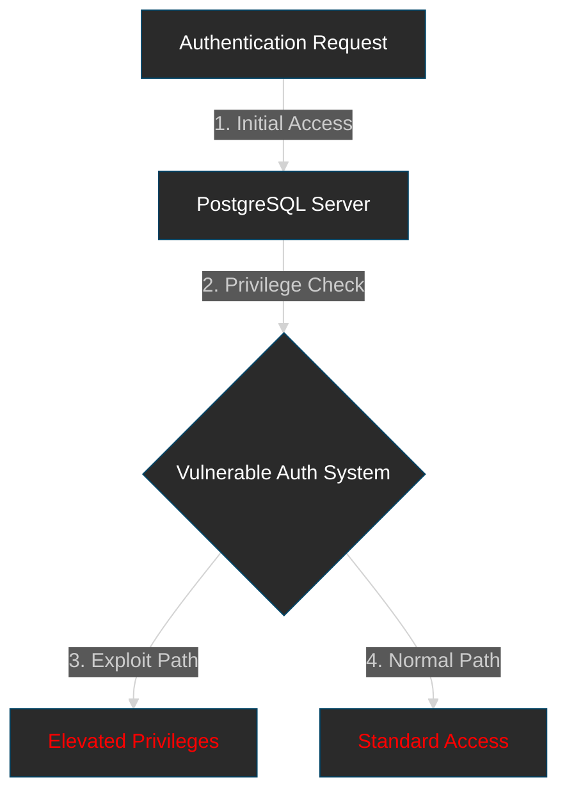

# Summary

This vulnerability is similar to the plot of "Inception" - where attackers can manipulate the kernel's memory management to elevate privileges, essentially planting an idea (malicious code) deep within the system's subconscious (kernel space). Just as the characters in Inception could manipulate dreams to access restricted information, attackers can manipulate kernel memory to gain system-level access.
# Technical Details

| Detail           | Description                                                            |
| ---------------- | ---------------------------------------------------------------------- |
| Definition       | PostgreSQL privilege escalation vulnerability in authentication system |
| CVE ID           | CVE-2024-20674                                                         |
| Affected Systems | PostgreSQL versions 12-16                                              |
| Severity         | High (CVSS 8.8)                                                        |
| Discovery Date   | January 2024                                                           |
| Patch Status     | Fixed in versions 16.2, 15.6, 14.11, 13.14, and 12.18                  |
## Affected Systems

- Windows 10 version 1809 and later
- Windows 11 21H2 and later
- Windows Server 2019 and later

## Attack Prerequisites

- Local access to system
- Standard user privileges initially
- Unpatched system (pre-February 2024 patch)

## Event Monitoring Table

|Event ID|MITRE ATT&CK|Kill Chain Phase|Command Line Pattern|Tools/Scripts|
|---|---|---|---|---|
|4688|T1068 - Exploitation for Privilege Escalation|Exploitation|Process Creation with unusual memory allocation patterns|Custom exploit code|
|4657|T1562.001 - Impair Defenses|Defense Evasion|Registry modifications to security settings|PowerShell scripts|
|1|T1562.002 - Disable Windows Event Logging|Defense Evasion|Service control manager operations|sc.exe|

## Technical Steps

1. Memory Manipulation Detection:

```powershell
Get-WinEvent -FilterHashtable @{LogName='Security';    ID=4688; Data='*VirtualAlloc*' }
```

2. Registry Monitoring:

```powershell
New-ItemProperty -Path "HKLM:\SYSTEM\CurrentControlSet\Control\Session Manager\Memory Management" -Name "FeatureSettingsOverride" -Value 0 -PropertyType DWORD -Force
```

---
## Rule Creation

### Sysmon Configuration

```xml
<RuleGroup name="CVE-2024-20674 Detection">             <ProcessCreate onmatch="include"> 
    <CommandLine condition="contains">VirtualAlloc
    </CommandLine>                                        <IntegrityLevel>System</IntegrityLevel>             </ProcessCreate> 
</RuleGroup>
```

### Windows Event Forwarding Rule

```xml
<Select Path="Security"> *[System[(EventID=4688)] and EventData[Data[@Name='NewProcessName'] contains 'memory']] 
</Select>
```


> [!warning] Warning
 This vulnerability is particularly dangerous as it allows attackers to bypass Windows security controls by exploiting kernel memory management. Detection should focus on unusual memory allocation patterns and unexpected privilege escalation events.




## Further Reading 📚
- [Official PostgreSQL Security Advisory](https://www.postgresql.org/about/news/postgresql-releases-162-156-1411-1314-and-1218-2715/)
- [NIST NVD Entry](https://nvd.nist.gov/vuln/detail/CVE-2024-20674)
- [Red Hat Security Advisory](https://access.redhat.com/security/cve/cve-2024-20674)

---
# Sources

1. MITRE ATT&CK: [https://attack.mitre.org/techniques/T1068/](https://attack.mitre.org/techniques/T1068/)
2. Microsoft Security Advisory: [https://msrc.microsoft.com/update-guide/vulnerability/CVE-2024-20674](https://msrc.microsoft.com/update-guide/vulnerability/CVE-2024-20674)
3. Windows Security Log Events: [https://www.ultimatewindowssecurity.com/securitylog/encyclopedia/](https://www.ultimatewindowssecurity.com/securitylog/encyclopedia/)
4. Sysmon Documentation: [https://docs.microsoft.com/en-us/sysinternals/downloads/sysmon](https://docs.microsoft.com/en-us/sysinternals/downloads/sysmon)