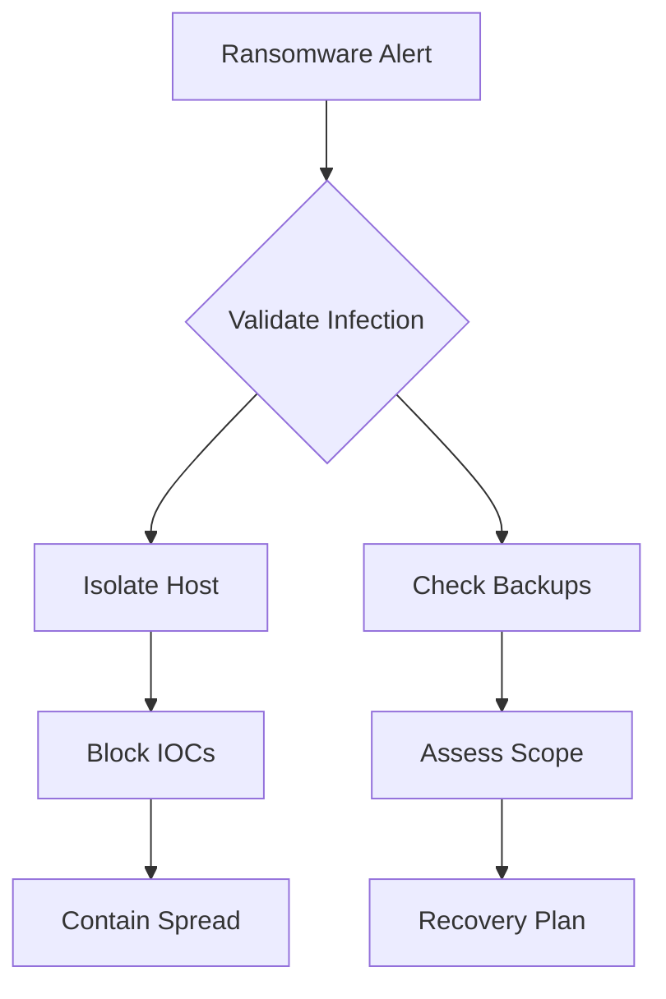

# Malware Attacks: Advanced Detection & Response Guide

## Common Malware Types & Indicators

### 1. Ransomware
**Example: Recent Attack Pattern**
```
Initial Access → PowerShell Download → File Encryption → Ransom Note
|
└── Indicators:
    - Mass file access/modification
    - High disk I/O
    - Shadow copy deletion
    - Encrypted files (.locked extension)
    - Stopped services
    - Modified wallpaper
```

### 2. Remote Access Trojans (RATs)
**Common Behavior Pattern:**
```
Process Tree:
chrome.exe
└── rundll32.exe
    └── svchost.exe (unusual parent)
        └── powershell.exe -enc [base64]
            └── External C2 connection
```

### 3. Fileless Malware
**Detection Pattern:**
```
Suspicious Activity Chain:
1. LOLBin Execution (regsvr32, mshta)
2. Memory-only payload
3. WMI persistence
4. Scheduled task creation
5. Registry modifications
```

### 4. Banking Trojans
**Indicators:**
```
- Browser process injection
- Certificate store access
- Keylogging behavior
- Screen capture
- Form grabbing
- Network callbacks
```

## Real-Time Detection Scenarios

### Scenario 1: Active Ransomware Infection

#### Initial Alert
```
Time: 10:15 AM EST
Source: EDR Platform
Priority: Critical
Alert: Mass File Encryption Activity
Affected Host: WKSTN-FINANCE3
User: sarah.jones
Process: unknown.exe
```

#### Detection Process

1. **Immediate Triage** (First 2 minutes)
```
Quick Checks:
- Process activity spikes
- Network connections
- File modifications
- Registry changes
- Service disruptions
```

2. **IOC Analysis** (Next 5 minutes)
```powershell
# Sample Detection Query
Get-WinEvent -FilterHashtable @{
    LogName = 'Security','System'
    ID = 4688,7045,4663
} | Where-Object {
    $_.TimeCreated -gt (Get-Date).AddMinutes(-15)
}
```

3. **Scope Assessment** (Next 10 minutes)
```
Check for:
- Lateral movement
- Domain controller access
- Backup system status
- Email indicators
- Network segregation
```

### Scenario 2: Advanced RAT Detection

#### Initial Alert
```
Time: 15:30 PM EST
Source: Network IDS
Alert: Suspicious Beaconing Activity
Host: WKSTN-DEV2
Destination: 185.123.xxx.xxx:443
Protocol: HTTPS (Anomalous Pattern)
```

#### Investigation Process

1. **Process Analysis**
```
Get running processes:
- Parent-child relationships
- Network connections
- File handles
- Memory regions
- Loaded DLLs
```

2. **Network Analysis**
```
Network Indicators:
- Beaconing intervals
- Data patterns
- Protocol anomalies
- DNS requests
- TLS fingerprints
```

3. **Host Forensics**
```
Artifacts to Collect:
- Process memory dumps
- Network captures
- Registry hives
- Event logs
- Prefetch files
```

## Immediate Response Actions

### 1. Ransomware Response


### 2. RAT/Backdoor Response
```
Priority Actions:
1. Host Isolation
2. Memory Capture
3. Network Block
4. C2 Blocklist
5. Credential Reset
```

### 3. Fileless Malware Response
```
Investigation Steps:
1. Memory Analysis
2. PowerShell Logging
3. WMI Activity Check
4. Registry Analysis
5. Scheduled Task Audit
```

## Advanced Detection Methods

### 1. Behavioral Analysis
```yaml
Suspicious Behaviors:
  Process_Injection:
    - CreateRemoteThread calls
    - VirtualAllocEx usage
    - Process hollowing
    
  Defense_Evasion:
    - Shadow copy deletion
    - Security tool termination
    - Log clearing
    
  Persistence:
    - Registry AutoRuns
    - Scheduled Tasks
    - Service creation
```

### 2. Network Detection
```
Traffic Analysis:
1. DGA Domain Detection
2. Beaconing Patterns
3. Protocol Anomalies
4. TLS Inspection
5. DNS Tunneling
```

### 3. Memory Analysis
```
Memory Indicators:
- Injected code regions
- Suspicious handles
- Hidden threads
- Hooked functions
- Encrypted strings
```

## YARA Rule Examples

### 1. Ransomware Detection
```yara
rule Ransomware_Behavior {
    meta:
        description = "Detects common ransomware behaviors"
        severity = "Critical"
    
    strings:
        $encrypt_api = "CryptEncrypt"
        $ransom_note = "YOUR_FILES_ARE_ENCRYPTED"
        $delete_shadows = "vssadmin delete shadows"
    
    condition:
        uint16(0) == 0x5A4D and
        2 of them and
        filesize < 2MB
}
```

### 2. RAT Detection
```yara
rule RAT_Capabilities {
    meta:
        description = "Detects RAT capabilities"
        
    strings:
        $keylog = "GetAsyncKeyState"
        $screen = "BitBlt"
        $inject = "CreateRemoteThread"
        
    condition:
        all of them and
        pe.imports("ws2_32.dll")
}
```

## Response Playbooks

### 1. Ransomware Response
```
Priority: Critical
Timeline: Immediate

1. Isolation (0-15 minutes):
   - Network disconnect
   - System shutdown
   - Share dismount
   
2. Analysis (15-60 minutes):
   - Malware identification
   - IOC collection
   - Scope assessment
   
3. Containment (1-2 hours):
   - Block IOCs
   - Alert users
   - Secure backups
   
4. Recovery (2+ hours):
   - System restoration
   - Data recovery
   - Service verification
```

### 2. Persistence Hunting
```
Search Locations:
1. Registry:
   - HKLM\Software\Microsoft\Windows\CurrentVersion\Run
   - HKCU\Software\Microsoft\Windows\CurrentVersion\RunOnce
   
2. File System:
   - Startup folders
   - System32 directory
   - User profile
   
3. WMI:
   - Event consumers
   - Filter bindings
   - Provider checks
```

## Prevention & Hardening

### 1. System Hardening
```
Priority Controls:
1. Application Whitelisting
2. PowerShell Constrained Language
3. Block LOLBins
4. Network Segmentation
5. EDR Deployment
```

### 2. User Controls
```
Security Measures:
1. Least Privilege
2. Application Control
3. Email Filtering
4. Web Filtering
5. Macro Blocking
```

## Key Interview Points

### 1. Detection Strategy
- Multi-layered approach
- Behavior vs. signature
- False positive handling
- Alert correlation

### 2. Response Methodology
- Speed vs. thoroughness
- Evidence preservation
- Business impact
- Communication flow

### 3. Recovery Process
- System restoration
- Data recovery
- Root cause analysis
- Improvement implementation


Some key points to emphasize in your interview:

1. The importance of understanding malware behavior patterns
2. Quick containment while preserving evidence
3. The value of proper incident documentation
4. The need for continuous monitoring and improvement

---
<div style="text-align: center;">
	<div class="gradient-text">👾 2024 rabb1th0les (Chris A)dams 👾</div> 
	🌴☀Thanks for supporting my page ☀🌴
	<nav>
		<ul style="list-style: none; padding: 0;">
			<div style="text-align: center;">
				<li><a href="index.html">Home</a> | <a href="Contact.html">Contact</a></li>
			</div>
		</ul>
	</nav>	
</div>