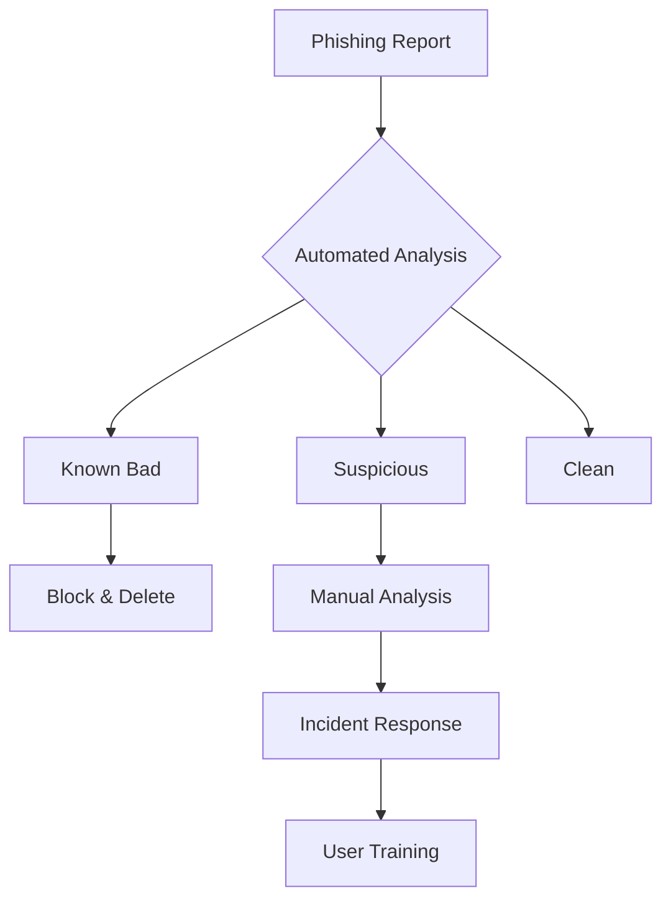

# Phishing & Social Engineering: A Detailed Analysis Guide

## Types of Phishing Attacks

### 1. Traditional Phishing
**Description:** Mass-distributed emails targeting large groups of users
**Example:**
```
Subject: Your Amazon Account Has Been Suspended
From: security@arnazon-support.com
Message: Dear Customer, Your Amazon account has been temporarily suspended due to unusual activity. Click here to verify your account: [malicious link]
```
**Red Flags:**
- Slightly misspelled domain (arnazon vs amazon)
- Generic greeting
- Urgency in message
- Suspicious link URL

### 2. Spear Phishing
**Description:** Targeted attacks using personal information
**Example:**
```
Subject: Q4 Budget Review - Action Required
From: cfo.john.smith@company-corp.net [spoofed]
Message: Hi Sarah, Following up on yesterday's meeting, I need you to review the updated Q4 numbers ASAP. Please download the spreadsheet here: [malicious link]
I'm in a board meeting but need this within the hour.
Thanks, John [CFO signature block]
```
**Red Flags:**
- Spoofed internal email
- Reference to real events/people
- Time pressure
- Unusual request from senior executive

### 3. Business Email Compromise (BEC)
**Description:** Targeting financial transactions through compromised or spoofed business communications
**Example:**
```
Subject: Re: Invoice Payment Update
From: accounts@supplier-company.com
Message: Dear [Finance Team Member],
We've updated our banking details. Please use the following account for the pending payment of Invoice #45692:
Bank: [Bank Name]
Account: [Number]
Swift: [Code]
Please process this urgently as we're closing our books.
```
**Red Flags:**
- Last-minute banking changes
- Urgency
- Irregular payment process
- Slight variations in email domain

## Common Social Engineering Tactics

### 1. Pretexting
**Scenario:** Attacker poses as IT support
```
"Hi, this is Dave from IT Support. We're seeing some unusual activity from your workstation. I need your login details to run some diagnostics..."
```

### 2. Quid Pro Quo
**Scenario:** Offering something in exchange for information
```
"Congratulations! You've won a $50 Amazon gift card. Just verify your employee credentials at [malicious link] to claim..."
```

### 3. Baiting
**Scenario:** Using physical media
```
[USB drives labeled "Confidential - Q4 Salary Review" left in company parking lot]
```

## Detection Mechanisms

### 1. Email Header Analysis
```
Received: from mail.legitcompany.com [192.168.1.1]
X-Originating-IP: [suspicious IP]
Return-Path: <different-domain@attacker.com>
```

### 2. URL Analysis
Common Deceptions:
- microsoft-security.tk
- amazonn.com
- google.login-verify.com
- dropbox.file-share.net

### 3. DMARC/SPF/DKIM Indicators
```
Authentication-Results: spf=fail (sender IP is 192.0.2.1)
smtp.mailfrom=company.com; dkim=fail (signature did not verify)
header.d=company.com; dmarc=fail action=quarantine
```

## Advanced Attack Patterns

### 1. Multi-Stage Phishing
```
Stage 1: LinkedIn connection request from fake recruiter
Stage 2: Job discussion over email
Stage 3: Request to fill out "application form" (credential harvester)
Stage 4: Malware disguised as "salary calculator"
```

### 2. Supply Chain Compromise
```
Legitimate vendor email account compromised
↓
Attacker monitors communication patterns
↓
Hijacks real invoice thread
↓
Sends updated banking details
```

## Investigation & Response Checklist
<div class="neon-line"></div>
f
### Initial Triage
1. Check email headers
2. Verify sender domain authenticity
3. Inspect attachment hashes
4. URL reputation check
5. User activity timeline

### Containment Steps
1. Isolate affected systems
2. Block malicious domains/IPs
3. Reset compromised credentials
4. Preserve evidence
5. Document incident timeline

### Response Actions


## Detection Tools & Techniques

### 1. Email Security Tools
- `ProofPoint`
- `Mimecast`
- `Microsoft Defender for Office 365`

### 2. Network Analysis
- Wire data analysis (`Wireshark`)
- DNS request monitoring
- SSL/TLS inspection
- Network flow analysis

### 3. Endpoint Detection
- Browser plugin behavior
- Process creation monitoring
- PowerShell logging
- Registry modifications

## Mitigation Strategies

### Technical Controls
1. Email authentication (`DMARC/SPF/DKIM`)
2. Anti-spoofing rules
3. URL reputation filtering
4. Attachment sandboxing
5. Zero-trust network access

### Administrative Controls
1. Regular phishing simulations
2. Security awareness training
3. Clear reporting procedures
4. Incident response playbooks
5. Policy enforcement

## Real-World Impact Metrics
- Average cost per BEC incident: $80,000
- Phishing success rate: ~4% of recipients
- Average detection time: 3-4 hours
- Response time objective: <1 hour

Remember: Social engineering attacks constantly evolve. Regular training and updated detection mechanisms are crucial.


This detailed guide should help you prepare for interview questions about phishing and social engineering. A few key points to emphasize during your interview:

1. The importance of correlating multiple indicators
2. Understanding human psychology in social engineering
3. The value of both technical and user-focused mitigations

---

# Phishing Incident Analysis & Response Scenarios

## Scenario 1: Business Email Compromise Attempt

### Initial Alert
```
Time: 09:15 AM EST
Alert Type: Email Security Gateway
Priority: High
Details: Suspicious email detected attempting to bypass SPF
From: ceo@company-domain.com
To: accounts.payable@company.com
Subject: Urgent Wire Transfer Required
Would you like to practice analyzing a lateral movement scenario? I can provide a detailed case study and guide you through the investigation process with interview-style questions.```

### Email Content
```
From: Michael Stevens <ceo@company-d0main.com>
Subject: Urgent Wire Transfer Required
Date: Mon, Nov 18, 2024 09:14:23 -0500

Hi Sarah,

I need you to process an urgent wire transfer for a new supplier. Please keep this confidential as it's part of an upcoming acquisition. Amount: $247,500

I'm in meetings all day but need this processed ASAP. Let me know once done.

Regards,
Michael Stevens
CEO, Company Inc.
```

### Detection Process

1. **Initial Triage** (First 5 minutes)
   - Examine email headers
   ```
   X-Originating-IP: 185.234.xxx.xxx [Suspicious IP range]
   Authentication-Results: spf=fail smtp.mailfrom=company-d0main.com
   DKIM-Signature: Not Present
   ```
   - Domain analysis reveals typosquat: "company-d0main.com" vs. legitimate "company-domain.com"
   - Check IP reputation: Located in known malicious hosting range

2. **Threat Correlation** (Next 10 minutes)
   - Search SIEM for:
     * Similar emails from this sender
     * Recent login attempts from the source IP
     * Any successful emails from this domain
   - Check threat intelligence platforms for domain/IP indicators

3. **Scope Assessment** (Next 15 minutes)
   - Search mail logs for similar patterns
   - Identify any other recipients
   - Check if any users have interacted with the email
   - Review any recent successful wire transfers

### Response Actions

1. **Immediate Actions** (First 30 minutes)
   ```
   Priority: Critical
   Timeline: Immediate
   ```
   - Block sending domain in email security gateway
   - Add IP to blocklist
   - Quarantine all emails from this sender
   - Alert Finance department to suspend wire transfers pending verification

2. **Containment** (Next hour)
   - Search and delete all instances of the email across mailboxes
   - Block any URLs or attachments at the proxy level
   - Implement additional approval steps for wire transfers
   - Reset passwords for any users who interacted with the email

3. **Investigation & Documentation**
   ```
   Evidence Collection:
   - Original email headers
   - Email body content
   - Server logs
   - User activity logs
   - Wire transfer records
   ```

## Scenario 2: Spear Phishing with Malware

### Initial Alert
```
Time: 14:22 PM EST
Alert Source: EDR Platform
Priority: High
Alert: Suspicious PowerShell activity following email link click
Affected Host: WKSTN-USER45
User: robert.jenkins@company.com
```

### Detection Process

1. **Initial Triage** (First 5 minutes)
   - Review EDR alert details:
   ```
   Process: powershell.exe
   Command Line: -enc JABjAGwAaQBlAG4AdA[...]
   Parent Process: outlook.exe
   User Context: robert.jenkins
   ```
   - Isolate affected workstation
   - Check email that triggered the activity

2. **Enhanced Analysis** (Next 15 minutes)
   ```
   Timeline Analysis:
   14:20 - Email received
   14:21 - Link clicked
   14:22 - PowerShell execution
   14:23 - DNS requests to suspicious domain
   ```
   - Decode PowerShell command
   - Review network connections
   - Check for persistence mechanisms

3. **Scope Assessment** (Next 30 minutes)
   - Hunt for similar PowerShell patterns
   - Check for lateral movement indicators
   - Review email recipients list
   - Analyze potential data exfiltration

### Response Actions

1. **Immediate Containment**
   ```
   Priority: Critical
   Timeline: Immediate
   ```
   - Network isolation of affected host
   - Block C2 domains at firewall
   - Disable user account
   - quarantine similar emails

2. **Investigation Steps**
   - Memory dump of affected system
   - Full disk image capture
   - Network traffic analysis
   - PowerShell script analysis

3. **Remediation Plan**
   ```
   Timeline: Next 4 hours
   Steps:
   1. Reimage affected workstation
   2. Reset user credentials
   3. Block identified IOCs
   4. Update email filtering rules
   ```

## Scenario 3: Credential Harvesting Campaign

### Initial Alert
```
Time: 11:05 AM EST
Source: Cloud Security Platform
Priority: Medium
Alert: Multiple users accessing suspicious OAuth application
Application: "Microsoft 365 Document Viewer"
```

### Detection Process

1. **Initial Assessment** (First 5 minutes)
   - Review OAuth application details:
   ```
   App Name: Microsoft 365 Document Viewer
   Publisher: Unverified
   Permissions: Mail.Read, Files.ReadWrite.All
   Users Affected: 12
   ```
   - Check application authorization timestamps
   - Review permissions granted

2. **Threat Hunting** (Next 15 minutes)
   - Search for related phishing emails
   - Check access logs for affected accounts
   - Review any data access by the application
   - Monitor for data exfiltration attempts

### Response Actions

1. **Immediate Actions**
   ```
   Priority: High
   Timeline: Immediate
   ```
   - Revoke OAuth application access
   - Force password reset for affected users
   - Block application ID in Azure AD
   - Enable MFA for affected accounts

2. **User Communication**
   ```
   Priority: High
   Method: IT Support Ticket
   Timeline: Within 1 hour
   ```
   - Notify affected users
   - Provide incident details
   - Request suspicious activity report
   - Share security awareness reminder

## Key Interview Talking Points

### 1. Detection Methodology
- Emphasize multi-source correlation
- Explain prioritization process
- Discuss automation vs. manual analysis
- Highlight importance of baseline knowledge

### 2. Response Strategy
- Speed vs. accuracy balance
- Containment priority
- Evidence preservation
- Communication flow

### 3. Documentation Requirements
- Chain of custody
- Incident timeline
- Action items tracking
- Lessons learned

### 4. Prevention Improvements
- Technical controls
- Policy updates
- Training needs
- Monitoring enhancements

Remember to emphasize:
1. The importance of quick initial triage
2. The value of proper evidence collection
3. The need for clear communication channels
4. The balance between containment and business continuity


These scenarios represent common incidents you might handle as an MDR analyst. A few key points to emphasize in your interview:

1. The importance of understanding normal vs. abnormal behavior
2. How to prioritize alerts based on severity and business impact
3. The value of proper documentation throughout the incident

Would you like to practice walking through one of these scenarios? I can play the role of the interviewer and ask you specific questions about how you'd handle different aspects of the investigation.

---
<div style="text-align: center;">
	<div class="gradient-text">👾 2024 rabb1th0les (Chris A)dams 👾</div> 
	🌴☀Thanks for supporting my page ☀🌴
	<nav>
		<ul style="list-style: none; padding: 0;">
			<div style="text-align: center;">
				<li><a href="index.html">Home</a> | <a href="Contact.html">Contact</a></li>
			</div>
		</ul>
	</nav>	
</div>
```

---
<div style="text-align: center;">
	<div class="gradient-text">👾 2024 rabb1th0les (Chris A)dams 👾</div> 
	🌴☀Thanks for supporting my page ☀🌴
	<nav>
		<ul style="list-style: none; padding: 0;">
			<div style="text-align: center;">
				<li><a href="index.html">Home</a> | <a href="Contact.html">Contact</a></li>
			</div>
		</ul>
	</nav>	
</div>
