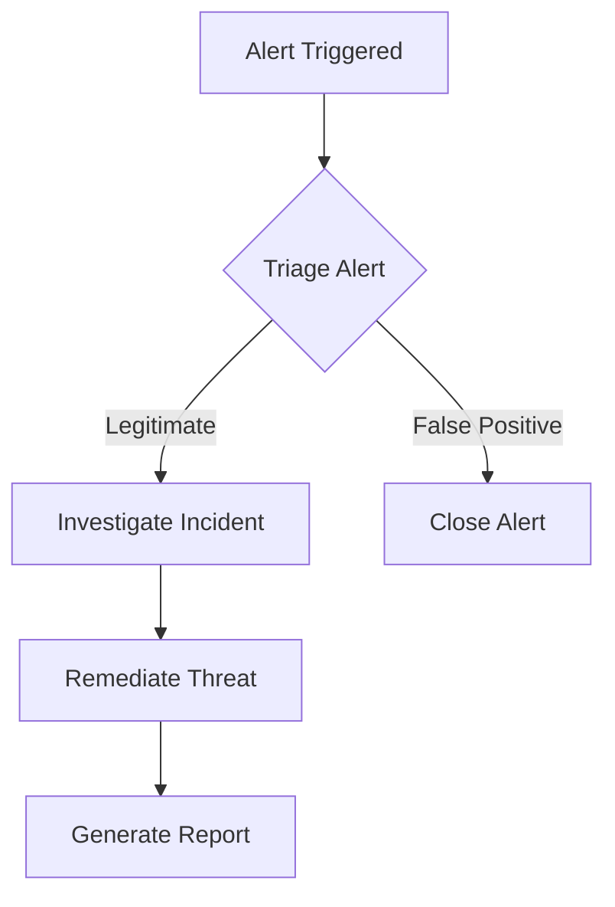

In cybersecurity, complexity is a constant companion. Whether it’s mapping a network, illustrating an attack path, or documenting an incident response workflow, visual clarity can make or break our understanding of the systems and threats we deal with daily. That’s where **diagrams as code** come in—an incredibly powerful tool for visualizing complex ideas with precision and ease.

As someone who relies heavily on tools like **Mermaid.js** and **draw.io**, I’ve seen firsthand how scoping and priming can transform a simple diagram into a robust learning and communication asset. With just a little planning, these tools can unlock incredible potential for both teaching and understanding cybersecurity concepts.

---

When working with Mermaid.js diagrams, **scoping** and **priming** are key to getting the most accurate and useful results. Before you dive into writing or requesting a diagram, it’s essential to take the time to clarify and refine the question or concept you’re visualizing.

- **Priming** involves providing the right context—what problem are you trying to solve, and who is the intended audience? For example, are you illustrating a high-level network topology or a detailed incident response process?
- **Scoping** ensures you focus on the relevant details. If you're mapping out a security workflow, what are the key steps that need to be visualized? Avoid cramming too much information into a single diagram, as it can overwhelm the viewer.

When asking for a Mermaid diagram, these steps help narrow down the diagram’s structure, making it more meaningful and easier to interpret. A well-defined request saves time and ensures that the final visual representation hits the mark—whether it’s for quick prototyping, documentation, or teaching complex cybersecurity concepts.

---
### **What Are Diagrams as Code?**

If you’ve ever wished for an easier way to create, edit, and maintain diagrams without the pain of dragging shapes around endlessly, diagrams as code might be your new best friend. The concept is simple:

- Write your diagram as text (code).
- Use a tool to render it into a clean visual.
- Tweak the text to update the diagram instantly.

With **Mermaid.js**, for example, you can create flowcharts, sequence diagrams, and even Gantt charts with just a few lines of code embedded in Markdown files. It’s lightweight, intuitive, and integrates seamlessly with tools like Obsidian and GitHub. Meanwhile, **draw.io** provides a more visual drag-and-drop interface for diagrams, but it’s just as valuable when you need to collaborate or manually refine details.

---

### **Why Scoping and Priming Are Game-Changers**

Creating a diagram isn’t just about tossing shapes onto a canvas; it’s about telling a story. That’s where **scoping** and **priming** come in.

- **Priming**: Before diving in, ask yourself a few questions:
    
    - What’s the goal of this diagram?
    - Who’s the audience—technical peers, stakeholders, or yourself?
    - Is this a high-level overview or a detailed breakdown?
- **Scoping**: Once you’ve answered these, limit the focus. Trying to cram every detail into one diagram is tempting but counterproductive. Break complex systems into smaller, digestible chunks and link diagrams together if needed.
    

For example, in a network defense scenario, you might:

1. Start with a high-level map of the architecture.
2. Zoom in on specific segments, like DMZ zones or critical servers, in separate diagrams.
3. Highlight key threats or vulnerabilities relevant to the scenario.

---

### **The Learning Advantage**

From a functional learning perspective, diagrams as code are invaluable. When I first started using **Mermaid.js** to visualize cybersecurity workflows, I was amazed at how quickly I could iterate and refine my understanding. For example:

- **Mapping MITRE ATT&CK techniques**: Seeing techniques laid out visually helped me grasp their relationships and applicability.
- **Incident response flowcharts**: Step-by-step workflows became clearer, especially for practicing in lab environments.
- **Threat modeling**: Visualizing potential attack paths or data flows revealed gaps I hadn’t noticed in written documentation.

By removing the friction of traditional diagramming tools, diagrams as code allowed me to focus on the logic and structure of what I was visualizing rather than the mechanics of creation.

---

### **Why Mermaid.js and draw.io?**

Each tool shines in different ways:

|**Tool**|**Strengths**|
|---|---|
|**Mermaid.js**|Lightweight, integrates with Markdown, perfect for code-first workflows, fast updates.|
|**draw.io**|Visual drag-and-drop interface, ideal for collaboration and manual tweaks.|

In cybersecurity, I often combine both. For quick, reproducible visuals—Mermaid.js is my go-to. But when I need to refine details or collaborate with a team, draw.io steps in seamlessly.

### **Mermaid.js: The Code-First Visualization Tool**

Mermaid.js is a versatile, text-based diagramming tool that's especially popular among developers and cybersecurity professionals who prefer working in a code-centric environment. It integrates seamlessly with Markdown-based tools like Obsidian and GitHub, making it ideal for anyone who thrives in a plain-text workflow.

#### **Key Features of Mermaid.js**

| **Feature**                     | **Benefit**                                                                                   |
| ------------------------------- | --------------------------------------------------------------------------------------------- |
| Text-Based Diagramming          | Write your diagrams as code, making them version-controlled and easy to edit.                 |
| Wide Range of Diagram Types     | Supports flowcharts, sequence diagrams, Gantt charts, entity-relationship diagrams, and more. |
| Lightweight and Fast            | Quick to set up and render, ideal for lightweight projects or rapid prototyping.              |
| Embeds in Markdown Environments | Works natively with Markdown tools like Obsidian, GitHub, and Notion.                         |
| Reusability and Scalability     | Once created, diagrams can be reused or modified without starting from scratch.               |

#### **Cybersecurity Use Cases for Mermaid.js**

- **Threat Modeling**: Quickly sketch out attack vectors or data flows based on MITRE ATT&CK techniques.
- **Incident Response Workflows**: Create step-by-step guides for handling security incidents.
- **Network Architecture Mapping**: Visualize simple network layouts or workflows for explaining key concepts.
- **Documentation**: Integrate diagrams directly into Markdown files for a seamless documentation process.

#### **Example Mermaid.js Diagram**

Here’s an example of a simple incident response flowchart in Mermaid.js:

Rendered, this creates a clear and concise visual workflow with just a few lines of text.

---

### **draw.io: The Visual Collaboration Tool**

Draw.io (or Diagrams.net) is a visual, drag-and-drop tool that’s excellent for creating detailed diagrams collaboratively or refining existing ones. It’s a web-based application, but it also offers desktop versions, making it accessible and versatile.

#### **Key Features of draw.io**

|**Feature**|**Benefit**|
|---|---|
|Drag-and-Drop Interface|Intuitive for visual thinkers, especially those new to diagramming tools.|
|Extensive Shape Libraries|Pre-built shapes for networking, cloud architecture, cybersecurity, and more.|
|Collaboration Tools|Real-time collaboration with teammates, ideal for shared projects or incident planning.|
|Cloud Integration|Works seamlessly with Google Drive, OneDrive, and GitHub for easy saving and sharing.|
|Customizability|Add icons, colors, and annotations to create polished, presentation-ready visuals.|

#### **Cybersecurity Use Cases for draw.io**

- **Network Diagrams**: Create detailed visualizations of complex network setups, including firewalls, servers, and endpoints.
- **Attack Path Modeling**: Map out potential attacker paths to highlight vulnerabilities and defense strategies.
- **System Design**: Visualize and document cloud infrastructure or microservices for DevSecOps projects.
- **Stakeholder Presentations**: Polish diagrams for executive presentations, making technical concepts accessible.

#### **Example Draw.io Diagram**

Imagine you’re creating a visual representation of a defense-in-depth strategy. With draw.io, you can use pre-built shapes to design a multi-layered defense model with firewalls, intrusion detection systems, and endpoint protection layers—all in a professional, visually appealing format.

---

### **Mermaid.js vs. draw.io: Choosing the Right Tool**

While both tools are powerful, they serve slightly different needs:

|**Criteria**|**Mermaid.js**|**draw.io**|
|---|---|---|
|**Ease of Use**|Best for code-first users.|Ideal for visual-first users.|
|**Collaboration**|Limited; requires external tools.|Built-in collaboration for teams.|
|**Customizability**|Limited to predefined formats.|Highly customizable with shapes and colors.|
|**Speed**|Faster for lightweight diagrams.|Better for detailed, presentation-ready visuals.|
|**Integration**|Seamless with Markdown-based workflows.|Works well with cloud storage solutions.|

---

### **Combining Mermaid.js and draw.io**

Using these tools together is often the best approach:

1. Start with **Mermaid.js** for rapid prototyping and iteration.
2. Refine your diagrams in **draw.io** for presentations or collaborative projects.

---

### **Final Thoughts: Empower Your Learning**

Diagrams as code offer more than just convenience—they’re a paradigm shift in how we approach learning and communicating in cybersecurity. With tools like Mermaid.js and draw.io, the barrier to creating clear, concise visuals is lower than ever.

So, the next time you’re wrestling with a complex idea or system, give diagrams as code a try. Start small, scope wisely, and see how even a few lines of code can transform your understanding.

---

### **What’s Your Take?**

Have you tried diagrams as code? How do you use visuals to simplify complex cybersecurity concepts? Let’s trade notes!